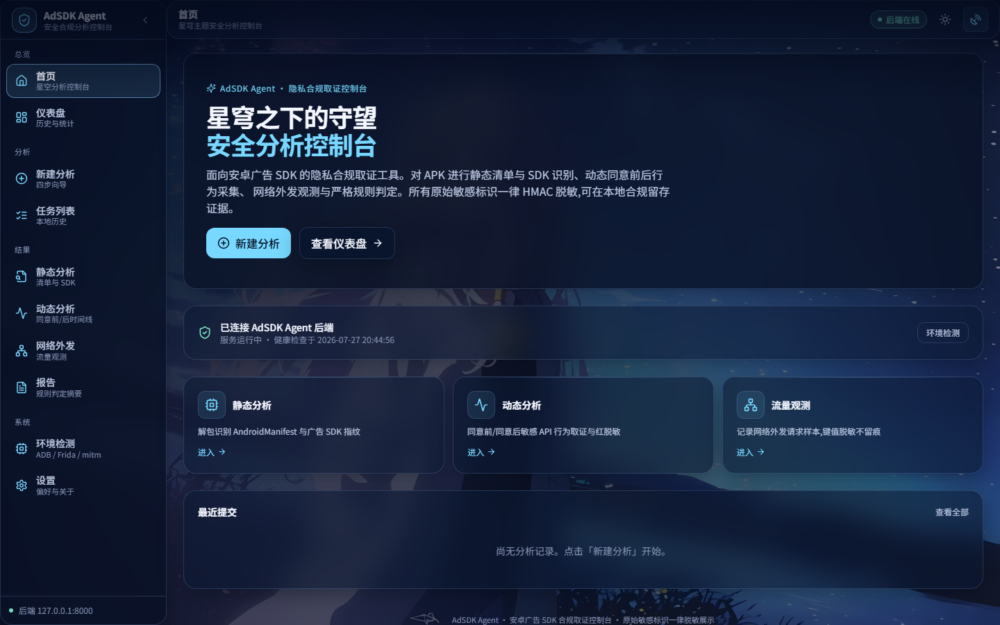

# AdSDK Agent

> 面向 Android APK 的本地隐私审计与合规分析平台。  
> 通过 Web 控制台完成任务提交、环境诊断、静态分析、动态行为观测、网络流量采集、证据关联、隐私发现与 AI 辅助研判。



> [!IMPORTANT]
> 本项目仅用于**已获得授权**的 APK 测试、隐私审计与合规分析。请勿用于未授权目标。  
> AI 只负责受约束的计划选择与报告叙述；所有事实、计数、风险和证据均由确定性工具产生。

## 核心能力

- **任务中心**：SQLite 持久化、后台执行、WebSocket 实时进度、取消、重试、删除与报告下载。
- **静态分析**：APK 安全快照、Manifest/权限解析、SDK 指纹识别、静态解包缓存与可解释风险摘要。
- **动态分析**：Frida 分层诊断、`strict / balanced / attach_only` 策略、A/B/C/D 证据等级、Native Bridge 崩溃分类与安全降级。
- **网络观测**：mitmproxy 独立会话、端口租约、代理恢复、零请求语义和敏感字段最小化。
- **Consent 时间线**：使用 monotonic 时间划分 `pre_consent / post_consent / unknown`，不依赖不可靠的文本顺序推断。
- **证据关联**：`correlation-v1` 按可信时间关联动态事件与网络请求，仅表达“时间接近”，不宣称因果。
- **隐私发现**：`privacy-findings-v2` 生成可追溯的观察事实、疑似风险与证据缺口，不输出法律结论。
- **AI 编排**：白名单工具、低 Token 两阶段调用、Evidence Digest、缓存、预算、引用校验与确定性降级。
- **真机安全信封**：设备确认门、租约、资源所有权、Consent 人工检查点、`try/finally` 清理与状态恢复。

最近一次 M7A 自动化验收基线：

```text
后端：699 passed
前端：30 test files / 325 tests passed
TypeScript：通过
生产构建：通过
```

## 系统架构

```text
┌──────────────────────────────────────────────────────────────┐
│                     React Web Console                        │
│ Dashboard / New Analysis / Tasks / Reports / Settings       │
└────────────────────────────┬─────────────────────────────────┘
                             │ HTTP / JSON / WebSocket
┌────────────────────────────▼─────────────────────────────────┐
│                        FastAPI Engine                         │
│ Task Center / Deterministic Analyzers / AI Orchestrator     │
│ Device Session / Evidence Pipeline / Report Generation      │
└───────────────┬──────────────────────┬────────────────────────┘
                │                      │
       ┌────────▼────────┐    ┌────────▼──────────────────────┐
       │ Android Device  │    │ Local State & Artifacts      │
       │ ADB + Frida     │    │ SQLite / output/runs / cache │
       └─────────────────┘    └───────────────────────────────┘
```

### 技术栈

| 前端                         | 后端与工具                      |
| ---------------------------- | ------------------------------- |
| React 18、TypeScript、Vite 6 | Python 3.12+、FastAPI、Pydantic |
| Tailwind CSS、Framer Motion  | apktool、ADB、Frida             |
| TanStack Query、Zustand      | mitmproxy / mitmdump            |
| Vitest、Testing Library、MSW | pytest                          |

------

## 功能说明

### 1. 任务中心与报告

新建分析统一通过 `POST /tasks` 创建。任务由本地线程池后台运行，状态与步骤写入 SQLite：

```text
output/state/adsdk-agent.db
```

支持：

- 任务列表、筛选、分页与关键字查询；
- WebSocket 实时进度，断开后自动降级为 HTTP 轮询；
- `queued / running` 任务取消；
- `completed / failed / cancelled` 任务重试；
- JSON、Markdown、HTML 报告下载；
- APK 版本对比；
- 旧浏览器 `localStorage` 记录只读兼容。

进程异常退出后，遗留的运行中任务会在下次启动时标记为失败，不会永久显示为运行中。

### 2. 静态分析

- 校验 APK 路径、允许根目录、ZIP 格式与大小；
- 创建原子快照并二次复核 SHA-256；
- 解析应用信息、Manifest、权限与组件；
- 识别广告、统计、推送、归因、定位和社交 SDK；
- 使用 `risk-v1` 生成 0–100 分的可解释风险摘要；
- 使用 SHA-256 静态解包缓存，避免重复运行 apktool；
- Manifest、SDK 或报告模块失败时按证据维度隔离，不阻断其他可评估部分。

静态缓存位置：

```text
output/cache/static-unpack/<APK_SHA256>/
```

### 3. 动态分析与 Frida 可靠性

动态分析显式绑定 `device_id`，同一设备上的状态变更任务使用排他租约。

策略：

| 策略          | 行为                                                         |
| ------------- | ------------------------------------------------------------ |
| `strict`      | 仅接受 `spawn_suspended`；失败后不降级                       |
| `balanced`    | 优先启动前 Hook；兼容性失败时可清理后回退到 `launch_then_attach` |
| `attach_only` | 仅附加已有进程，不覆盖早期启动阶段                           |

可靠性能力：

- `frida-diagnostics-v1` 分层检查 host、device、server、transport 与 target；
- `dynamic-evidence-quality-v1` 使用 A/B/C/D 表达覆盖范围与可信度；
- resume 后在稳定窗口内崩溃会记录真实 Native crash，不自动解释为反调试；
- MuMu x86_64 + ARM64 Native Bridge 场景可标记为 `native_bridge_compatibility_suspected`；
- 外部启动的 `frida-server` 不属于任务所有权，平台不会在任务结束时停止它；
- 平台不联网下载 `frida-server`，也不会覆盖未知设备文件。

### 4. 网络流量与 Consent

网络采集使用每任务独立的 `MitmSession`：

- 分配唯一端口并记录进程所有权；
- 任务结束恢复运行前读取到的设备代理值；
- 默认不保存认证头、Cookie、请求/响应正文或完整 query value；
- TLS Pinning 或证书问题导致可见性不足时如实记录，不实施绕过。

网络状态明确区分：

```text
collector_failed
collector_success_zero_requests
collector_success_requests_observed
```

零请求只表示当前观察窗口未记录到请求，不代表应用不会联网。

Consent 使用 monotonic 时间判定：

```text
event.monotonic < consent.monotonic   -> pre_consent
event.monotonic >= consent.monotonic  -> post_consent
invalid or missing timing data        -> unknown
```

缺少可信时间时，依赖该证据的规则返回 `not_evaluated`。

### 5. 证据关联与隐私发现

#### `correlation-v1`

- 默认时间窗口 `2500 ms`；
- 优先使用同任务 monotonic 时间，必要时才降级到可信 UTC；
- Consent 阶段冲突的候选不关联；
- 每个事件最多保留时间差最小的 5 个请求；
- 输出不包含 Cookie、Header、正文、原始 URL 或 query value。

#### `privacy-findings-v2`

将静态、动态、网络、Consent 和关联证据转换为：

- `observed`：已观察到的技术事实；
- `suspected`：证据支持的风险提示；
- `evidence_gap`：无法完成评估的证据缺口。

严重性与置信度分开计算；单条规则异常不会中断其他规则或报告生成。

> [!NOTE]
> “时间接近”不等于“事件触发了请求”；“未观察到”不等于“安全或合规”。

### 6. AI 编排与综合研判

AI 默认关闭。启用后，职责边界保持固定：

```text
确定性工具：产生事实、计数、证据和规则结果
AI：选择白名单工具、安排固定 DAG 中的步骤、整理风险优先级和最终叙述
```

AI 不能：

- 生成或执行任意 Shell、ADB、Frida、SQL、Python 命令；
- 增加未注册工具或越过设备确认门；
- 修改严重性、置信度或统计数字；
- 虚构域名、权限、SDK、事件或 Evidence ID；
- 输出法律合规结论；
- 保存或展示 reasoning content / Chain of Thought。

低 Token 机制：

- 常规分析最多一次规划调用和一次报告调用；
- `report_only` 使用确定性计划，跳过无价值的规划轮；
- capability router 只发送当前范围内的候选工具；
- 模型只接收 `evidence-digest-v1` 和压缩后的安全工具摘要；
- 相同输入命中缓存时模型调用为 0；
- 超预算、Provider 不可达或输出非法时，保留确定性结果并生成降级报告。

主要 AI 产物：

```text
ai-plan.json
evidence-digest.json
ai-tool-trace.json
ai-report.json
ai-runtime-diagnostics.json
```

### 7. DeepSeek 与 OpenAI-Compatible 运行时

Provider 默认使用 OpenAI-Compatible HTTP 接口，并可通过 profile 适配 DeepSeek：

- `AI_PROVIDER_PROFILE=auto` 可按 Base URL 主机识别；
- DeepSeek 默认显式发送 `thinking.type=disabled`；
- 规划、报告、修复使用独立输出 Token 上限；
- `usage` 明确区分供应商实报、估算与不可用；
- 兼容纯 JSON、Markdown fenced JSON 和带少量说明文字的 JSON；
- 401、403、404、408、413、422、429、5xx、超时和连接失败使用稳定错误码；
- 仅对可重试错误最多重试一次；
- `reasoning_content` 只记录是否存在，不保存内容。

### 8. M7A 真机 AI 全链路

`app/orchestration/` 为完整设备分析增加安全信封：

```text
environment_check
→ static_analysis
→ dynamic_analysis
→ traffic_analysis
→ evidence_correlation
→ privacy_findings
→ deterministic_report
→ ai_synthesis
→ cleanup

```

安全约束：

- 任何设备状态变更前采集 `device-session-v1` 快照；
- 操作前必须经过明确的设备变更确认；
- 资源区分 `external` 与 `owned_by_run`，只清理本轮拥有的资源；
- Consent 由用户手动完成，AI 不能自动确认；
- 取消、失败、超时和预算耗尽均进入 `finally` 清理；
- 代理恢复值来自本轮初始快照，不硬编码；
- 应用数据不会被清除，设备不会被重启，SSL Pinning 不会被绕过。

MuMu 实机验收与限制见：

- [M7A 全链路设计](docs/M7A_AI_FULL_ANALYSIS.md)
- [M7A MuMu 验收记录](docs/M7A_MUMU_ACCEPTANCE.md)

------

## 快速开始

### 1. 克隆项目

```powershell
git clone <your-repository-url>
cd adsdk-agent

```

### 2. 配置 Python 环境

项目统一使用根目录 `.venv`：

```powershell
py -3.14 -m venv .venv
.venv\Scripts\Activate.ps1

$env:PYTHONUTF8 = "1"
python -m pip install --upgrade pip
python -m pip install -r requirements.txt
Copy-Item .env.example .env
python -m pip check

```

> Python 3.12+ 可用；当前 Windows 开发环境推荐 Python 3.14。

确认命令来自当前虚拟环境：

```powershell
Get-Command python, frida, frida-ps, mitmdump |
  Select-Object Name, Source

```

并确保外部工具可用：

```powershell
adb version
apktool --version
frida --version
mitmdump --version

```

部署前必须替换 `.env` 中的开发脱敏密钥：

```env
REDACTION_HMAC_KEY=replace-with-a-strong-random-secret

```

### 3. 安装前端依赖

```powershell
cd web
npm install
cd ..

```

可选的前端地址配置：

```env
# web/.env
VITE_API_BASE_URL=http://127.0.0.1:8000
VITE_USE_MOCK=false

```

### 4. 一键启动

双击或执行：

```text
start-adsdk-agent.bat

```

默认地址：

```text
Web 控制台：http://127.0.0.1:5173
后端服务：http://127.0.0.1:8000
API 文档：http://127.0.0.1:8000/docs

```

停止服务：

```text
stop-adsdk-agent.bat

```

脚本仅停止当前项目启动的前后端进程，并清理 `.run/` 进程记录。

### 5. 手动启动

后端：

```powershell
.venv\Scripts\Activate.ps1
python -m uvicorn app.main:app --host 127.0.0.1 --port 8000

```

前端：

```powershell
cd web
npm run dev

```

------

## 使用流程

### 静态分析

1. 将已授权 APK 放入允许目录，例如 `samples/`；
2. 打开“新建分析”；
3. 输入 APK 的绝对路径；
4. 选择静态分析并提交；
5. 在任务详情或报告页查看结果。

### 动态分析

1. 启动设备或模拟器；
2. 确认 ADB 在线：

```powershell
adb devices -l

```

3. 在环境页检查 ADB、Frida、目标进程和抓包能力；
4. 选择精确 `device_id`；
5. 选择 `strict / balanced / attach_only`；
6. 配置 Consent 窗口与网络采集；
7. 提交并观察任务步骤、证据等级和清理结果。

### AI 全链路分析

1. 在“设置 → AI 编排”配置 Provider、Base URL、模型和 API Key；
2. 在“新建分析”选择 AI 编排与 `full_analysis`；
3. 阅读并确认设备状态变更清单；
4. 任务进入 Consent 检查点时，在设备中手动完成操作；
5. 查看确定性报告、AI 综合研判、Token 使用和资源清理状态。

------

## AI 配置与密钥安全

可以通过 `.env` 或前端设置页配置 AI，优先级固定为：

```text
环境变量 > 本机保存配置 > 代码默认值

```

本机配置文件：

| 文件                             | 内容                           |
| -------------------------------- | ------------------------------ |
| `output/config/ai-settings.json` | 非密钥配置，明文 JSON          |
| `output/config/ai-secret.bin`    | Windows DPAPI 加密后的 API Key |

安全保证：

- API Key 永不通过读取接口返回前端；
- 前端不将 Key 写入 `localStorage`、`sessionStorage`、IndexedDB、URL 或全局 Store；
- Key 不进入任务数据库、报告、缓存、日志或异常堆栈；
- 保存成功后前端立即清空 Key 输入状态；
- 非 Windows 平台不支持本机明文降级，请使用 `AI_API_KEY` 环境变量；
- 写配置接口只允许 loopback 客户端，带 `Origin` 时必须匹配本地前端来源。

测试连接先尝试 `/models`；若兼容服务返回 404/405，再使用一次 `max_tokens=1` 的最小聊天请求。

------

## 主要配置

完整配置以 [`.env.example`](.env.example) 为准。

### 分析与采集

| 变量                              |        默认值 | 说明                          |
| --------------------------------- | ------------: | ----------------------------- |
| `APK_ALLOWED_ROOTS`               |     `samples` | 允许访问的 APK 根目录         |
| `APK_MAX_SIZE_MB`                 |        `1024` | APK 大小上限                  |
| `REDACTION_HMAC_KEY`              |    开发占位值 | 部署时必须替换                |
| `FRIDA_READY_TIMEOUT_SECONDS`     |          `15` | Hook-ready 超时               |
| `FRIDA_SPAWN_STABILITY_SECONDS`   |           `3` | resume 后稳定观察窗口         |
| `FRIDA_SERVER_MANAGEMENT_ENABLED` |       `false` | 是否允许显式管理 frida-server |
| `MITM_PORT_START / END`           | `8080 / 8090` | mitmproxy 端口池              |
| `MITM_LISTEN_HOST`                |   `127.0.0.1` | mitmdump 监听地址             |
| `EVIDENCE_CORRELATION_WINDOW_MS`  |        `2500` | 事件—请求关联窗口             |

> 模拟器中的 `127.0.0.1` 指向模拟器自身。需要从模拟器访问宿主机抓包端口时，应按当前模拟器网络配置 `MITM_LISTEN_HOST` 与设备代理地址。

### AI 编排

| 变量                           |              默认值 | 说明                               |
| ------------------------------ | ------------------: | ---------------------------------- |
| `AI_ENABLED`                   |             `false` | AI 总开关                          |
| `AI_PROVIDER`                  | `openai_compatible` | Provider                           |
| `AI_BASE_URL`                  |                  空 | OpenAI-Compatible 根地址           |
| `AI_MODEL`                     |                  空 | 模型名                             |
| `AI_MAX_ROUNDS`                |                 `2` | 模型轮数上限                       |
| `AI_MAX_TOOL_CALLS`            |                 `6` | 工具调用上限                       |
| `AI_MAX_INPUT_TOKENS`          |              `6000` | 输入预算                           |
| `AI_MAX_OUTPUT_TOKENS`         |              `1800` | 全局输出上限                       |
| `AI_CACHE_ENABLED`             |              `true` | 是否启用缓存                       |
| `AI_CACHE_TTL_SECONDS`         |             `86400` | 缓存 TTL                           |
| `AI_PROVIDER_PROFILE`          |              `auto` | `auto / generic_openai / deepseek` |
| `AI_THINKING_MODE`             |          `disabled` | DeepSeek 思考模式控制              |
| `AI_PLANNER_MAX_OUTPUT_TOKENS` |               `500` | 规划阶段输出上限                   |
| `AI_REPORT_MAX_OUTPUT_TOKENS`  |              `1000` | 报告阶段输出上限                   |
| `AI_REPAIR_MAX_OUTPUT_TOKENS`  |               `300` | 修复阶段输出上限                   |
| `AI_ALLOW_DYNAMIC_TOOLS`       |             `false` | 是否允许动态工具进入候选集         |

### M7A

```env
M7A_LEASE_STALE_SECONDS=600
M7A_CONSENT_WAIT_SECONDS=900

```

------

## API 概览

### 分析与任务

```text
POST   /tasks
GET    /tasks
GET    /tasks/system/status
GET    /tasks/{task_id}
GET    /tasks/{task_id}/report
POST   /tasks/{task_id}/cancel
POST   /tasks/{task_id}/retry
DELETE /tasks/{task_id}
WS     /ws/tasks/{task_id}

```

### 报告与产物

```text
GET /tasks/{task_id}/artifacts/json
GET /tasks/{task_id}/artifacts/markdown
GET /tasks/{task_id}/artifacts/html

```

### Consent 检查点

```text
GET  /tasks/{task_id}/consent-checkpoint
POST /tasks/{task_id}/consent-checkpoint

```

可提交的动作：

```text
confirmed
not_found
skipped

```

### AI

```text
GET    /ai/status
GET    /ai/settings
PUT    /ai/settings
POST   /ai/settings/test
DELETE /ai/settings/api-key

GET  /tasks/{task_id}/ai-plan
GET  /tasks/{task_id}/ai-report
GET  /tasks/{task_id}/ai-runtime-diagnostics
POST /tasks/{task_id}/ai-report/regenerate

```

### 其他

```text
GET  /env/check
GET  /traffic/check
POST /frida/diagnostics
GET  /frida/status
POST /frida/server/deploy
POST /frida/server/start
POST /frida/server/stop
POST /comparisons
GET  /comparisons/{comparison_id}

```

完整接口与模型以运行中的 Swagger 文档为准：

```text
http://127.0.0.1:8000/docs

```

------

## 输出产物

```text
output/runs/<run_id>/
├─ input/app.apk
├─ unpacked/
├─ hook.log
├─ events.raw.jsonl
├─ events.json
├─ frida.protocol-errors.jsonl
├─ traffic/
│  ├─ flows.mitm
│  ├─ requests.jsonl
│  └─ mitm.stderr.log
├─ traffic_summary.json
├─ correlations.json
├─ privacy-findings.json
├─ sessions.json
├─ ai-plan.json
├─ evidence-digest.json
├─ ai-tool-trace.json
├─ ai-report.json
├─ ai-runtime-diagnostics.json
├─ report.json
├─ report.md
└─ report.html

```

M7A 任务还会记录设备会话、资源所有权、清理结果和全链路验收摘要。真实运行产物、SQLite、缓存、日志和 `.env` 均位于忽略目录，不进入 Git。

------

## 状态语义

### 任务与步骤

| 状态                  | 含义                       |
| --------------------- | -------------------------- |
| `queued`              | 等待执行                   |
| `running`             | 正在执行                   |
| `success / completed` | 成功完成                   |
| `partial`             | 有有效结果，但存在明确限制 |
| `failed`              | 核心执行失败               |
| `cancelled`           | 用户取消且完成必要清理     |
| `skipped`             | 该步骤未执行               |

### 规则与证据

| 状态              | 含义                           |
| ----------------- | ------------------------------ |
| `matched`         | 可信证据满足规则               |
| `not_matched`     | 证据有效，但未满足规则         |
| `not_evaluated`   | 缺少可信证据，无法判断         |
| `no_observations` | 当前观察窗口没有记录到对应数据 |
| `error`           | 模块或规则执行异常             |

`not_evaluated`、`no_observations` 和零请求都不能解释为“安全”。

------

## 隐私与安全边界

- 原始设备 serial 仅用于私有执行载荷，REST、WebSocket、页面和报告使用脱敏引用；
- Android ID、OAID、IMEI、广告 ID 等原值不进入正式发现或 AI Digest；
- 网络请求默认不保存认证头、Cookie、正文或完整 query value；
- AI 不接收完整 Hook 日志、logcat、`requests.jsonl`、Manifest XML 或 `report.json`；
- Prompt、模型响应正文和 reasoning content 不写入诊断产物；
- 每次任务使用独立 run、session、端口和输出目录；
- 设备状态变更必须确认，取消和异常同样执行资源清理；
- 删除任务默认删除索引，保留分析目录，避免误删证据；
- AI 报告不替代确定性证据区，也不构成法律合规结论。

------

## 测试

### 后端

```powershell
$baseTemp = Join-Path "D:\pytest-basetemp\adsdk-agent" (
  "full-" + [guid]::NewGuid().ToString("N")
)

.venv\Scripts\python.exe -m pip check
.venv\Scripts\python.exe -m pytest -q --basetemp $baseTemp

```

### 前端

```powershell
cd web
npm run typecheck
npm test -- --run
npm run build

```

测试覆盖输入校验、任务持久化、设备租约、Frida 可靠性、网络采集、Consent、证据关联、隐私发现、AI 预算/缓存/降级、配置密钥防泄漏、DeepSeek 兼容、M7A 清理与前端交互。

------

## 仓库结构

```text
adsdk-agent/
├─ app/
│  ├─ ai/                 # Provider、工具注册、Digest、编排、缓存与设置
│  ├─ analyzers/          # Manifest、SDK、关联与隐私发现
│  ├─ orchestration/      # M7A 设备会话、确认门、租约与清理
│  ├─ repositories/       # SQLite 数据访问
│  ├─ services/           # 任务与 AI 服务
│  ├─ tasks/              # 任务模型与执行
│  ├─ tools/              # apktool、ADB、Frida、mitmproxy 封装
│  └─ main.py             # FastAPI 应用装配与路由
├─ web/src/
│  ├─ api/                # API 客户端
│  ├─ components/         # 通用、分析、报告与设置组件
│  ├─ hooks/              # TanStack Query Hooks
│  ├─ pages/              # 页面
│  ├─ stores/             # Zustand 状态
│  ├─ test/               # 测试基建
│  ├─ types/              # TypeScript API 类型
│  └─ utils/
├─ tests/
├─ docs/
├─ samples/
├─ scripts/
├─ output/                # 本地状态与产物，不进入版本控制
├─ .env.example
├─ requirements.txt
├─ start-adsdk-agent.bat
└─ stop-adsdk-agent.bat

```

------

## 文档导航

- [产品化工作流](docs/PRODUCTIZED_WORKFLOW.md)
- [动态分析可靠性](docs/DYNAMIC_RELIABILITY.md)
- [Frida 分层诊断](docs/FRIDA_DIAGNOSTICS.md)
- [MuMu 动态验收](docs/MUMU_DYNAMIC_ACCEPTANCE.md)
- [M7A AI 全链路设计](docs/M7A_AI_FULL_ANALYSIS.md)
- [M7A MuMu 验收记录](docs/M7A_MUMU_ACCEPTANCE.md)
- [前端完成报告](docs/FRONTEND_COMPLETION_REPORT.md)
- [页面截图](docs/screenshots/)

------

## 已知限制

- 执行器是本地单进程线程池，不是跨机器分布式队列；
- 进程异常退出时，运行中的任务会在下次启动后标记失败，需要手动重试；
- 端口和部分资源租约为进程内管理，多 Worker 部署需划分独立端口段；
- 动态分析质量依赖应用可运行性、Frida/Native Bridge 兼容性、证书信任与 SSL Pinning；
- `attach_only` 和 `launch_then_attach` 无法证明覆盖应用最早启动阶段；
- 任务清理可恢复代理、租约和本轮拥有的进程，但不保证恢复目标应用原始进程状态；
- 浏览器 PDF 依赖本机打印设置，后端不生成原生 PDF；
- 非 Windows 平台不能使用 DPAPI 本机保存 API Key；
- AI Provider 输出可能不稳定，但确定性报告和证据始终是事实来源。

------

## 许可证

本项目采用 [Apache License 2.0](LICENSE)。

## M7B AI runtime hardening (Phase A)

Phase A validates and diagnoses AI plans locally, including session runtime/freshness gates and Reports diagnostics. Automated coverage is complete; real-device acceptance is deliberately pending the MuMu read-only preflight. See `docs/M7B_AI_RUNTIME_HARDENING.md`.
